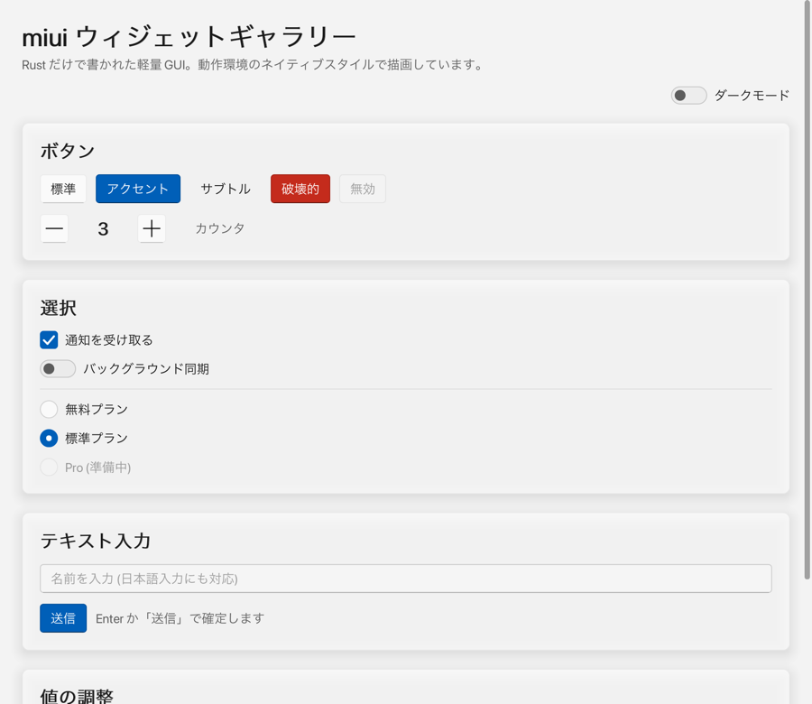
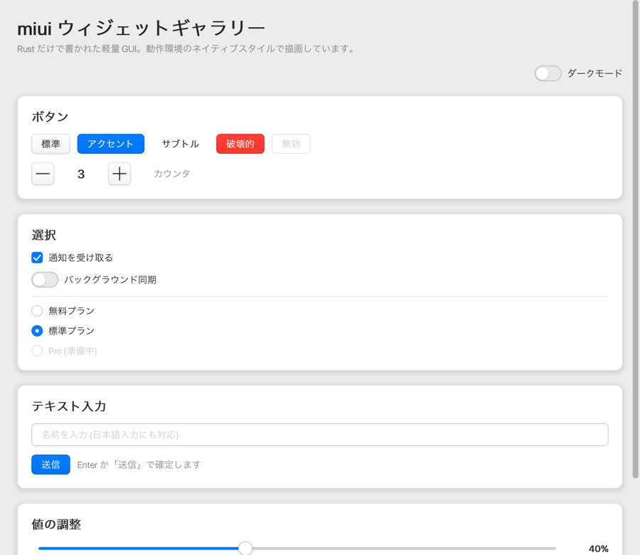
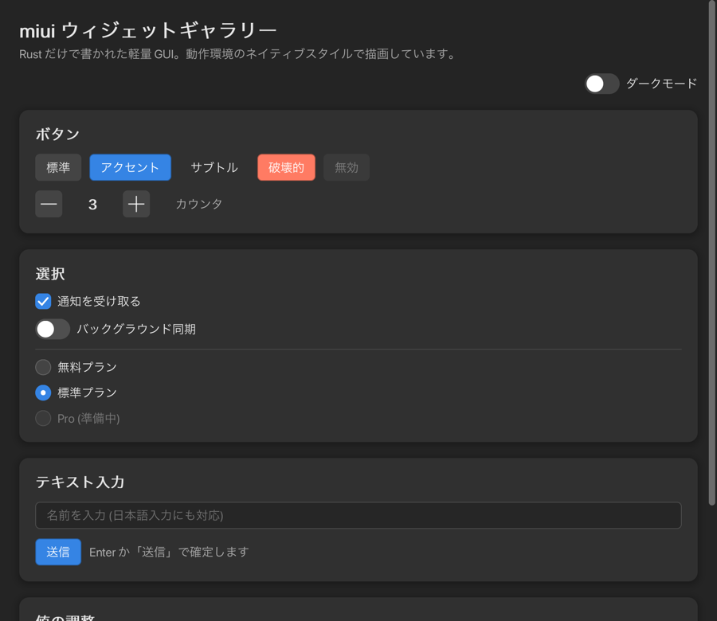
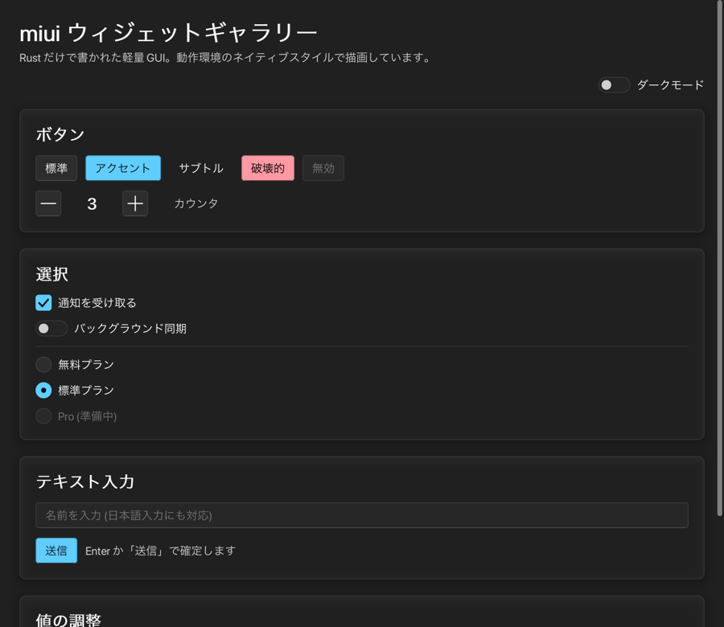

# miui

Rust だけで書かれた、とても軽量なクロスプラットフォーム GUI ツールキット。

**1 つの UI コードが、ビルドした環境のデザイン言語に沿った見た目になります。**
ビルド対象のトークンだけがバイナリに入り、他プラットフォームのスタイルは
そもそもコンパイルされません。

| ビルド対象 | 模しているデザイン言語 |
| --- | --- |
| Windows 11 | Fluent 2 (WinUI 3) |
| macOS | macOS (Aqua 系の現行デザイン) |
| Linux | Adwaita (GNOME / libadwaita) |
| Web (wasm) | ニュートラル |

> ### ⚠️ OS のネイティブウィジェットは使っていません
>
> miui はウィンドウに 1 枚のピクセルバッファを描くだけで、
> **WinUI 3 / AppKit / GTK4 のコントロールは一切呼びません。**
> ボタンもテキスト入力も miui が自前で描いた図形であり、
> 各 OS のデザイン言語を**模した再現**です。
>
> - ❌ OS のアクセシビリティツリーに乗りません (スクリーンリーダーが認識しません)
> - ❌ OS 標準のコンテキストメニューやドラッグ&ドロップは自前実装が必要です
> - ❌ OS のアクセントカラー設定などには追従しません
> - ✅ Web を含む 4 環境で、完全に同じ挙動・同じ見た目になります
> - ✅ 依存が極端に少なく、バイナリが小さくなります
>
> 本物のネイティブウィジェットが必要な用途には向きません。
> その場合は各 OS のツールキットを FFI で束ねる別の設計が必要です
> (ただし Web には対応できません)。

<table>
  <tr>
    <td width="50%"><br><sub>Fluent 2 (WinUI 3) / ライト</sub></td>
    <td width="50%"><br><sub>macOS / ライト</sub></td>
  </tr>
  <tr>
    <td><br><sub>Adwaita (GNOME) / ダーク</sub></td>
    <td><br><sub>Fluent 2 / ダーク</sub></td>
  </tr>
</table>

> いずれも **同一の `view()` コード** を、テーマトークンだけ差し替えて描いたものです。
> (比較画像の生成にはオプションの `all-styles` フィーチャを使っています。
> 通常のビルドでは、その環境のスタイルだけが入ります。)

---

## 設計

### ネイティブウィジェットは呼ばず、自前で描く

冒頭のとおり、WinUI 3 / AppKit / GTK4 の実ウィジェットを FFI で包む方法は
取っていません。4 つのツールキットを抱える重さと、Web に
「ネイティブウィジェット」が存在しないという原理的な問題があるためです。

代わりに miui は **描画を完全に自前で持ち**、ビルド対象のプラットフォームの
デザイントークン (色・寸法・角丸・フォーカスリングの形・タイポグラフィ) を
使って描きます。これにより

- 4 環境でピクセル単位に同じ挙動になる
- Web を含めてすべて同じコードパスを通る
- 依存が極端に少なく、バイナリが小さい

という性質が得られます。トレードオフは「OS の実ウィジェットではない」ことで、
アクセシビリティ API との統合は現時点では持っていません (後述)。

### 描画は SDF ベースのソフトウェアラスタライザ

GPU も外部 2D ライブラリ (tiny-skia / cairo / Skia) も使いません。
描画プリミティブは **符号付き距離関数 (SDF)** で統一してあります。

```rust
// crates/miui-render/src/sdf.rs
pub fn round_rect(px: f32, py: f32, hw: f32, hh: f32, radii: [f32; 4]) -> f32
pub fn segment(px: f32, py: f32, ax: f32, ay: f32, bx: f32, by: f32) -> f32
```

この 2 つから、塗り・線・影・アイコンをすべて導出します。

| 描きたいもの | 被覆率の求め方 |
| --- | --- |
| 角丸矩形の塗り | `coverage(d)` |
| 内側の枠線 (CSS の border 相当) | `coverage(d) - coverage(d + width)` |
| ドロップシャドウ | `blurred_coverage(d, blur)` |
| チェックマーク / 矢印 | 線分 SDF を太らせる |

1 種類の評価ループしか無いので実装量が小さく、
どの図形も同じ品質のアンチエイリアスになります。

### 依存クレート

`miui` の直接依存は 3 つだけです。

| クレート | 用途 | 代替不可の理由 |
| --- | --- | --- |
| `winit` | ウィンドウ生成・入力イベント | OS ごとのウィンドウ実装を 4 環境ぶん書き直すのは現実的でない |
| `softbuffer` | ピクセルバッファの提示 | 同上 (GPU は使わない) |
| `fontdue` | TrueType グリフのラスタライズ | フォントのアウトライン解釈まで自作するのは範囲外 |

レイアウト、イベント配送、描画、テーマ、ウィジェットはすべて自前です。

**実測値** (このリポジトリの `gallery` 例):

- ネイティブ release バイナリ: **約 660 KB** (macOS arm64、フォント埋め込み無し)
- wasm (wasm-bindgen 後): **約 500 KB** (フォント埋め込み無し)
- 依存クレート総数: 44 (winit のプラットフォームバックエンドを含む)

---

## クレート構成

```
crates/
  miui-core     … 幾何 / 色 / イベント / レイアウト制約 / 描画インタフェース /
                  デザイントークンの型 / ウィジェット抽象  (OS 非依存・描画非依存)
  miui-render   … SDF ソフトウェアラスタライザ + フォント / グリフキャッシュ
  miui-theme    … トークン実体。既定ではビルド対象のスタイルだけをコンパイルする
  miui-widgets  … 標準ウィジェットとレイアウトコンテナ
  miui          … winit + softbuffer のランタイム、ヘッドレス描画、prelude
examples/
  counter       … 最小サンプル
  gallery       … 全ウィジェットのデモ
```

依存の向きは `core ← render / theme / widgets ← miui` の一方向で、
ウィジェットは「どの OS で動いているか」を一切知りません。

---

## 使い方

```rust
use miui::prelude::*;

#[derive(Default)]
struct Counter {
    count: i32,
}

#[derive(Clone)]
enum Msg {
    Increment,
    Decrement,
}

impl Application for Counter {
    type Message = Msg;

    fn view(&self) -> Element<Msg> {
        Element::new(
            column()
                .spacing(12.0)
                .padding(Insets::all(24.0))
                .align(CrossAxis::Center)
                .child(Text::new(format!("{}", self.count)).title())
                .child(
                    row()
                        .spacing(8.0)
                        .child(Button::new("−").on_press(Msg::Decrement))
                        .child(Button::new("＋").accent().on_press(Msg::Increment)),
                ),
        )
    }

    fn update(&mut self, message: Msg) {
        match message {
            Msg::Increment => self.count += 1,
            Msg::Decrement => self.count -= 1,
        }
    }
}

fn main() {
    miui::run(Counter::default(), Settings::new("counter"));
}
```

状態は `update` でのみ変わり、`view` は毎回ツリーを組み直します
(Elm 風)。ホバー・フォーカス・キャレット位置・スクロール量といった
「UI 側の状態」は、ツリー内の位置から決まる安定した `Id` をキーに
ランタイムが保持するため、組み直しても失われません。

### テーマ

既定では、ビルド対象のデザイン言語に対応するトークンを、
OS のライト / ダーク設定に合わせて構築します。
アプリ側で配色を固定したい場合は `Application::theme` を実装します。

```rust
fn theme(&self, _env: &Environment) -> Theme {
    miui::theme::for_target(ColorMode::Dark)   // 常にダーク
}
```

`for_target()` が返すトークンはビルド対象で決まります。他プラットフォームの
スタイルは既定ではコンパイルされないため、`miui::theme::fluent` などを
macOS 向けビルドから参照することはできません。

デザインの比較やスクリーンショット生成のために全スタイルを一度に扱いたい場合
だけ、`all-styles` フィーチャを有効にすると `for_style(style, mode)` が使えます。

```toml
miui = { version = "0.1", features = ["all-styles"] }
```

---

## 標準ウィジェット

| 分類 | ウィジェット |
| --- | --- |
| 表示 | `Text` (Body / Strong / Caption / Subtitle / Title)、`Divider`、`ProgressBar` |
| 操作 | `Button` (Standard / Accent / Subtle / Danger)、`IconButton`、`Checkbox`、`Switch`、`Radio`、`Slider`、`TextInput` |
| レイアウト | `column()` / `row()` (Flexbox 部分集合)、`Container` (カード / パディング / 揃え)、`SizedBox`、`Spacer`、`Scroll` |

キーボード操作は Tab でのフォーカス移動、Space / Enter での実行、
矢印キーでのスライダー操作に対応しています。
フォーカスリングはキーボード操作時のみ表示され、Fluent では二重リング、
その他では 1 本のリングという各プラットフォームの流儀に従います。

---

## ビルドと実行

### ネイティブ

```sh
cargo run -p gallery --release
```

```sh
cargo run -p counter
```

### Web (wasm)

ブラウザには OS のフォントファイルを読む手段が無いため、
**実在するフォントファイルのパスを渡して wasm に埋め込む必要があります**
(プレースホルダのままでは失敗します)。

```sh
cargo install wasm-bindgen-cli --version 0.2.127   # Cargo.lock と同じ版である必要がある
cd examples/gallery/web
./build.sh "/System/Library/Fonts/ヒラギノ角ゴシック W3.ttc"
python3 -m http.server 8080
# → http://localhost:8080/
```

フォントの例:

| OS | パス |
| --- | --- |
| macOS | `/System/Library/Fonts/ヒラギノ角ゴシック W3.ttc` |
| Windows | `C:/Windows/Fonts/YuGothM.ttc` |
| Linux | `/usr/share/fonts/opentype/noto/NotoSansCJK-Regular.ttc` |

`build.sh` は `wasm32-unknown-unknown` ターゲットが無ければ自動で追加し、
`wasm-bindgen` CLI の有無とバージョン一致も確認して、
ずれていれば実行すべき `cargo install` コマンドを表示します。

Web ではキャンバスがブラウザのビューポート全体を使い、リサイズにも追従します
(`Settings::size` / `min_size` はネイティブでのみ有効)。

自作アプリから使う場合は `Settings::font` に渡します。

```rust
const FONT: &[u8] = include_bytes!("../assets/NotoSansJP-Regular.ttf");

let settings = Settings::new("app").font(FontSpec::new(FONT.to_vec()));
```

### スクリーンショットの生成 / ヘッドレス描画

ウィンドウを開かずに UI をピクセルバッファへ描けます。
見た目の回帰テストや CI での検証に使えます。

```sh
# 4 スタイル × ライト / ダークを BMP で出力 (all-styles フィーチャが必要)
cargo run -p gallery --bin shot --features all-styles -- ./shots
```

```rust
let mut headless = miui::headless::Headless::new();
let buffer = headless.render(&app, &theme, 800, 600, 2.0);   // 0x00RRGGBB
```

---

## テスト

```sh
cargo test --workspace
```

- レイアウト規則 (フレックス配分、パディング、交差軸のストレッチ、`Id` の安定性)
- テーマのコントラスト比 (本文 4.5:1 以上、アクセント面 3:1 以上、
  スイッチのオフ状態が地と区別できること)。`--features all-styles` を付けると
  4 スタイル × ライト / ダークの全 8 組み合わせを検証します。
- ヘッドレスでの操作 (クリック、押下キャンセル、ホバー、チェック、
  日本語を含む文字入力とバックスペース、スライダーの値決定)

---

## 対応状況

### 検証済み

| 環境 | 状態 |
| --- | --- |
| macOS (arm64) | 実行・描画・テスト |
| Web (wasm32) | ブラウザで実行。ポインタ / キーボード / 配色切り替え / ビューポート追従を確認 |
| Windows (x86_64-pc-windows-msvc) | `cargo check` によるコンパイル確認のみ |
| Linux (x86_64-unknown-linux-gnu) | `cargo check` によるコンパイル確認のみ (Wayland 構成。X11 バックエンドは `tiny-xlib` のビルドに pkg-config のクロス設定が必要なため、この確認環境では未検証) |

Windows / Linux は実機での目視確認をしていません。
`cfg` で分岐するコードパス (フォント探索、プラットフォーム判定) は
コンパイル確認までです。

### 既知の制限

- **アクセシビリティ**: OS のアクセシビリティツリー (UI Automation / NSAccessibility /
  AT-SPI) に接続していません。スクリーンリーダーからは「1 枚の絵」に見えます。
  自前描画である以上、対応するには AccessKit のようなブリッジを別途組む必要があります。
- **テキスト整形**: 字形の合成 (シェーピング)、双方向テキスト、複雑な結合文字に
  未対応です。字送りとカーニングのみ扱います。
- **IME**: 未確定文字列のインライン表示と下線描画には対応していますが、
  変換候補ウィンドウの位置指定 (`set_ime_cursor_area`) は未実装です。
- **クリップボード**: 未実装です。
- **アニメーション**: 時間ベースのアニメーションループを持ちません。
  状態遷移は即時に描き替わります。
- **描画性能**: CPU ラスタライズのため、非常に大きなウィンドウで全面を
  再描画し続ける用途には向きません。部分再描画は未実装です。
- **Web の初期フレーム**: キャンバスのサイズ確定が 1 フレーム遅れるため、
  読み込み直後にごく短時間だけ既定サイズで描かれることがあります。

---

## ライセンス

MIT OR Apache-2.0
